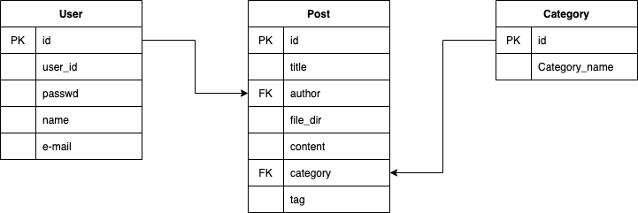
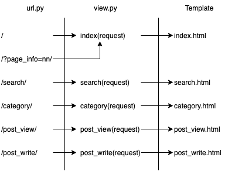

## Django blog 만들기

### DB 설계

## url 설계

## to do

* Paginator(~~index.html~~, category.html)
* ~~index.html의 h1, p 태그 ellipsis 설정~~
* post_view 작성(기본 형식, markdown 형식) : post 보기
* post_write 작성(기본 형식, markdown 형식) : post 작성
* search 작성(DB의 title, content, tag 이용)
* 전체 기능 구현 후 레이아웃 다시 짜기(div)
* 이쁘게 꾸미기

## history

* 2020.07.02 - git 작성, index의 Paginator 생성
* 2020.07,03 - DB 재설계, search 기본 구조 구현, 레이아웃 다시 작성

