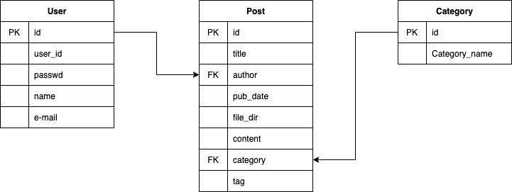

## Django blog 만들기

### DB 설계

## url 설계

## to do

* ~~Paginator(index.html, search.html, category.html)~~
* ~~index.html의 h1, p 태그 ellipsis 설정~~
* post_view 작성(~~기본 형식~~, markdown 형식) : post 보기
* post_write 작성(기본 형식, markdown 형식) : post 작성
* ~~search 작성(DB의 title, content, tag 이용)~~
* 전체 기능 구현 후 레이아웃 다시 짜기(div)
* 로그인 세션 관리

## history 
* 2020.07.09 - textarea 서식을 위해 div contenteditable으로 변경
* 2020.07.08 - 이미지 처리 구현, 마크다운(quote, strike, dot, number, link, )
* 2020.07.07 - 이미지 확장자 별로 올리고 화면별 처리 구현, 마크다운(bold, italic, >)구현
* 2020.07.06 - 로그인 로그아웃 구현, post_write 뼈대 구성
* 2020.07.05 - Paginator 구현, 네비게이션 바 카테고리 정렬
* 2020.07.04 - search 상세 구현(title, content, tag를 통해 검색 가능/대소문자 가능), post_view 기본 구조 구현
* 2020.07,03 - DB 재설계, search 기본 구*조* 구현, 레이아웃 다시 작성
* 2020.07.02 - git 작성, index의 Paginator 생성

